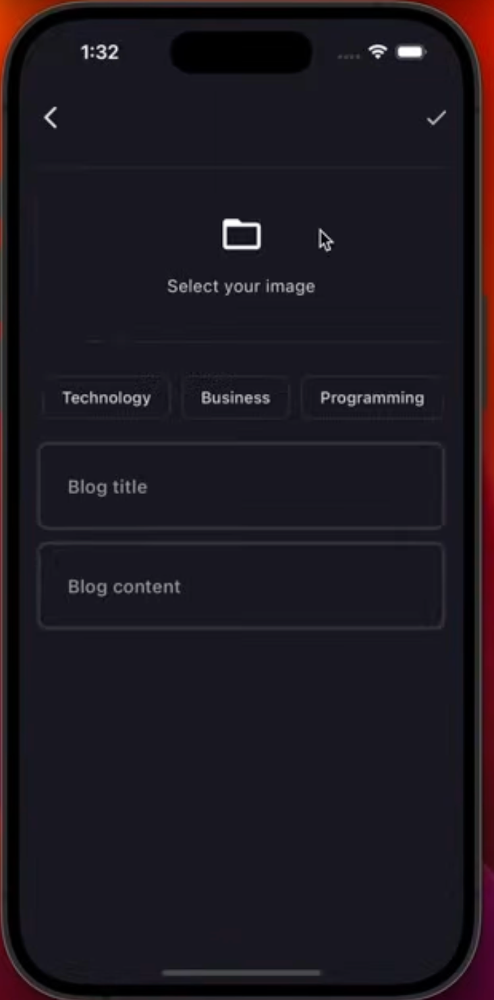
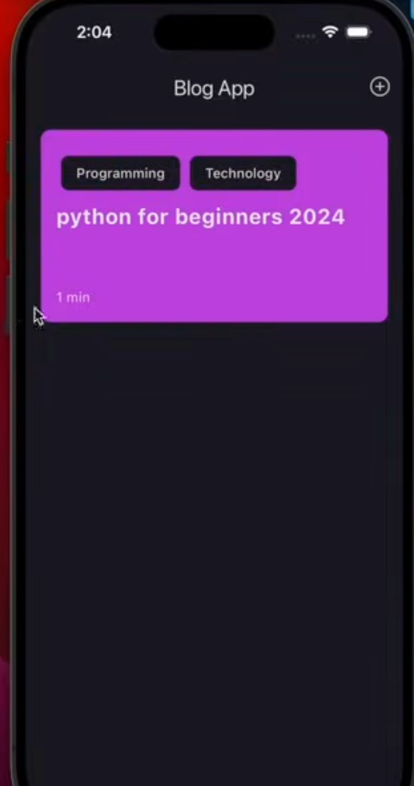
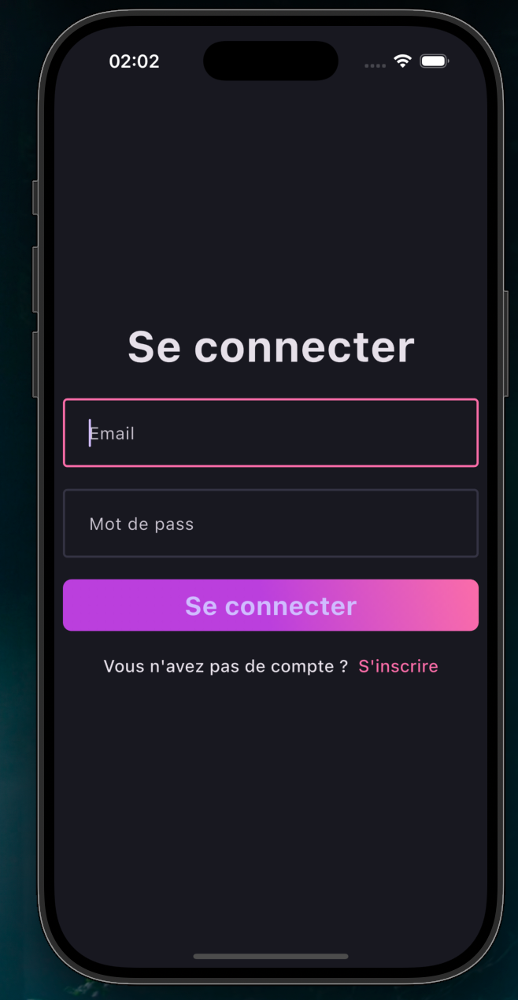
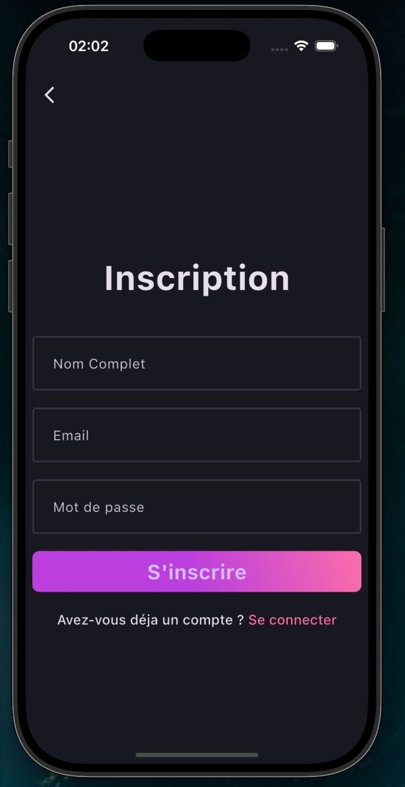

# blog_app

Une application mobile avec **Flutter** destinée aux blogs ici le l'utilisateur peut publier voir des blogs développée dans le cadre de ma formation .

## 🚀 Fonctionnalités
- Authentification avec supabase
- 
- Mode sombre
- Utilisation de Clean Architecture pour la structure du code

## 🛠️ Technologies utilisées
- **Framework :** Flutter
- **Langage :** Dart
- **Gestion d'état :** [Bloc / Cubit]
- **Outils :** [Supabase,Get it ]

## 📸 Aperçu

